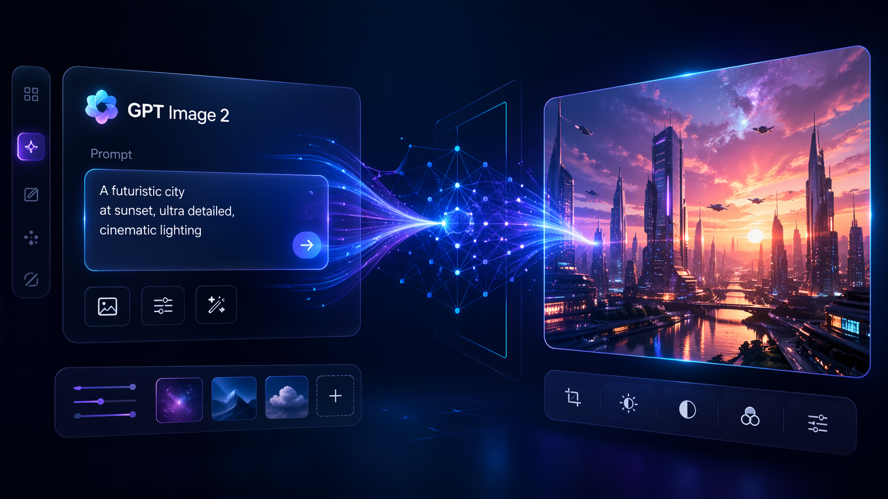

# GPT-Image-2 图像生成与编辑流程记录

这篇文章用于整理 GPT-Image-2 相关的图像生成与编辑流程。当前目录已经放入了封面图、工作流图和电商场景图，后续可以继续补充实际测试结论、提示词和使用场景。

## 为什么单独整理这篇文章

图像生成工具的更新很快，如果只把生成结果放进作品集，很容易忘记当时的测试目标、参数选择和编辑过程。把图片和文字放在同一个文章目录里，后续回看时会更清楚。

这篇文章可以记录三类信息：生成目标、编辑步骤、最终适合使用的场景。

## 生成与编辑工作流

下面这张图可以作为流程说明的入口。你可以在这里补充每一步的具体操作，例如从文本生成初稿、选择可用版本、局部修改、统一风格、导出网页素材。

## 电商场景测试

电商场景比较适合测试图像模型对商品主体、背景、光线和排版空间的控制能力。如果后续要做作品集展示，可以补充每张图对应的提示词、失败版本和最终选择理由。

## 后续可以补充什么

后续建议继续补充：

- 使用的模型和工具版本
- 关键提示词
- 哪些图适合直接展示，哪些需要后期处理
- 生成图片在网页、海报、电商详情页中的适配情况
- 失败样例和原因

这样这篇文章就不只是图片展示，也能成为一份可复用的创作流程记录。
